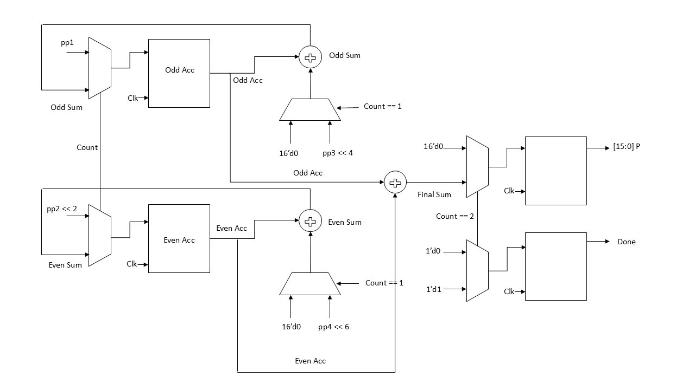

# Radix-4 Booth Multiplier (8-bit, CLA-Based)

## Overview
This project implements an 8-bit signed Booth Multiplier using Radix-4 Booth encoding and Carry Lookahead Adders (CLA). The design follows a multi-cycle approach with a dual-accumulator architecture to achieve a balanced trade-off between performance, hardware utilization, and power consumption.

---

## Key Features
- Radix-4 Booth encoding to reduce the number of partial products  
- CLA-based addition for faster arithmetic operations  
- Dual-accumulator structure for parallel computation  
- Multi-cycle execution enabling hardware reuse  
- Reduced area compared to Wallace tree implementations  
- Start/Done handshake for controlled operation  

---

## Architecture

### Description
The design consists of two parallel accumulation paths:
- The odd accumulator processes partial products corresponding to odd indices  
- The even accumulator processes partial products corresponding to even indices  

Both accumulators operate concurrently, allowing partial products to be combined efficiently. The intermediate results are then merged using a final adder to produce the output. Control logic and multiplexers regulate data flow and ensure correct sequencing across cycles.

---

## Comparison

| Architecture         | Cycles | Hardware | 
|---------------------|--------|----------|
| Traditional Booth   | 8      | Low      | 
| Wallace Tree        | 1      | Very High|    
| This Design         | 3      | Medium   | 

As we increase the number of bits and keep the ACC same,  we can save the hardware as well as can improve the speed too.

| Bits | Cycles | 
|------|--------|
| 8    | 3      | 
| 16   | 5      |   
| 32   | 9      | 
| 32   | 17     | 

If we can include more number of ACC i.e. in proportion of bits/4, then we can achieve less cycles for operation but hardware can bloat up but still its negotiable than wallace tree.

| Bits | Cycles | ACC |
|------|--------|-----|
| 8    | 3      | 2   |
| 16   | 3      | 4   |
| 32   | 3      | 8   |
| 64   | 3      | 16  |

---

## Tools Used
- Yosys for synthesis  
- EDA Playground for simulation  
- GTKWave for waveform analysis  

---

## Insight
This design demonstrates how combining parallelism with resource reuse can significantly improve efficiency while maintaining reasonable hardware complexity.
